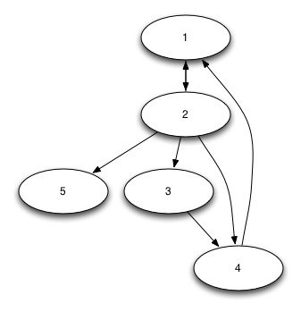

# Playground for graphs in Python

`example.py` creates a graph like



and prints paths to and from nodes. Output:

```
Paths from 1:
1: 1->2
2: 1->2->3
   1->2->5
3: 1->2->3->4
4: 
5: 

Paths from 1 (including circular): 
1: 1->2
2: 1->2->1
   1->2->3
   1->2->4
   1->2->5
3: 1->2->1->2
   1->2->3->4
   1->2->4->1
4: 1->2->1->2->1
   1->2->1->2->3
   1->2->1->2->4
   1->2->1->2->5
   1->2->3->4->1
   1->2->4->1->2
5: 1->2->1->2->1->2
   1->2->1->2->3->4
   1->2->1->2->4->1
   1->2->3->4->1->2
   1->2->4->1->2->1
   1->2->4->1->2->3
   1->2->4->1->2->4
   1->2->4->1->2->5

Paths from 3:
1: 3->4
2: 3->4->1
3: 3->4->1->2
4: 3->4->1->2->5
5: 

Paths to 3:
1: 2->3
2: 1->2->3
3: 4->1->2->3
4: 
5: 

Paths from 5:
1: 

Paths to 5:
1: 2->5
2: 1->2->5
3: 4->1->2->5
4: 3->4->1->2->5
5: 

Paths to 5 (including circular):
1: 2->5
2: 1->2->5
3: 2->1->2->5
   4->1->2->5
4: 1->2->1->2->5
   2->4->1->2->5
   3->4->1->2->5
5: 2->1->2->1->2->5
   4->1->2->1->2->5
   1->2->4->1->2->5
   2->3->4->1->2->5
```
